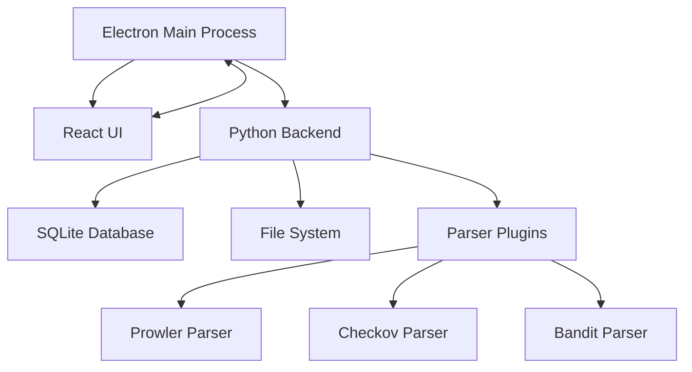

# 🔍 Scanalyzer

<div align="center">


**Intelligent Security Report Analysis for Your Desktop**

[](https://github.com/yourusername/scanalyzer/releases)
[](https://opensource.org/licenses/MIT)
[](https://github.com/yourusername/scanalyzer/releases)
[](https://github.com/yourusername/scanalyzer/actions)
[](https://github.com/yourusername/scanalyzer/security)

[Download](#-installation) • [Features](#-features) • [Documentation](docs/) • [Contributing](#-contributing)

</div>

---

## 📋 Overview

Scanalyzer is a powerful desktop application that consolidates and analyzes security reports from multiple scanning tools. It automatically parses reports from Prowler, Checkov, Bandit, and other security tools, providing a unified view of your security findings with intelligent insights and actionable recommendations.

### 🎯 Key Benefits

- **Unified Analysis**: Combine reports from multiple security tools in one place
- **Smart Parsing**: Automatically detects and parses various file formats
- **Local & Secure**: All data stays on your machine - no cloud dependencies
- **Time-Saving**: Automated report processing that typically takes hours manually
- **Actionable Insights**: Prioritized findings with clear remediation steps

## ✨ Features

### 🔧 Supported Security Tools
- **[Prowler](https://github.com/prowler-cloud/prowler)** - AWS/Azure/GCP security assessments
- **[Checkov](https://www.checkov.io/)** - Infrastructure as Code scanning
- **[Bandit](https://bandit.readthedocs.io/)** - Python code security linting
- *More parsers coming soon!*

### 📄 Supported File Formats
- **JSON** - Native format for most tools
- **XML** - Legacy tool outputs
- **PDF** - Generated security reports
- **DOCX** - Microsoft Word reports
- **CSV/XLSX** - Spreadsheet exports

### 🚀 Core Features
- **Drag & Drop Upload** - Simply drop your security reports
- **Real-time Processing** - Watch as findings are extracted
- **Advanced Filtering** - Filter by severity, tool, resource, or custom queries
- **Trend Analysis** - Track security posture over time
- **Bulk Export** - Export filtered findings to various formats
- **Dark Mode** - Easy on the eyes during long analysis sessions

## 📸 Screenshots

<div align="center">


</div>

## 💻 Installation

### System Requirements

- **Operating System**: Windows 10/11 or macOS 10.15+
- **Memory**: 4GB RAM minimum (8GB recommended)
- **Storage**: 500MB for application + space for reports
- **Display**: 1024x768 minimum resolution

### Download

Download the latest version for your platform:

<div align="center">

| Platform | Download | Version |
|----------|----------|---------|
| Windows | [Scanalyzer-Setup.exe](https://github.com/yourusername/scanalyzer/releases/latest/download/Scanalyzer-Setup.exe) | v1.0.0 |
| macOS | [Scanalyzer.dmg](https://github.com/yourusername/scanalyzer/releases/latest/download/Scanalyzer.dmg) | v1.0.0 |

</div>

### Installation Steps

#### Windows
1. Download `Scanalyzer-Setup.exe`
2. Run the installer (you may need to click "More info" → "Run anyway" if Windows Defender appears)
3. Follow the installation wizard
4. Launch Scanalyzer from the Start Menu or Desktop

#### macOS
1. Download `Scanalyzer.dmg`
2. Open the DMG file
3. Drag Scanalyzer to your Applications folder
4. Right-click and select "Open" for the first launch (due to Gatekeeper)

## 🚀 Quick Start

### 1. First Launch
When you first open Scanalyzer, you'll see the dashboard with a welcome message.

### 2. Upload Your First Report
- Click the **"Upload Report"** button or drag files onto the upload area
- Select one or more security report files
- Watch the progress as files are processed

### 3. Explore Findings
- Click on any finding to see detailed information
- Use the severity filters to focus on critical issues
- Sort columns to prioritize your remediation efforts

### 4. Export Results
- Select findings using checkboxes
- Click **"Export Selected"** 
- Choose your preferred format (CSV, JSON, or PDF)

## 🛠️ Development

### Prerequisites

- **Node.js** 18+ and npm 9+
- **Python** 3.11+
- **Git**
- **VS Code** (recommended)

### Setup

```bash
# Clone the repository
git clone https://github.com/yourusername/scanalyzer.git
cd scanalyzer

# Run the setup script
./scripts/setup.sh  # macOS/Linux
# or
scripts\setup.bat   # Windows

# This will:
# - Install Node.js dependencies
# - Set up Python virtual environment
# - Install Python dependencies
# - Initialize the database
# - Copy .env.example to .env
```

### Development Mode

```bash
# Terminal 1: Start the backend
cd backend
source venv/bin/activate  # Windows: venv\Scripts\activate
python -m app.main

# Terminal 2: Start the frontend
cd frontend
npm run dev
```

### Building

```bash
# Build for current platform
npm run build

# Build for all platforms
npm run build:all
```

### Testing

```bash
# Run all tests
npm test

# Frontend tests only
cd frontend && npm test

# Backend tests only
cd backend && pytest

# E2E tests
npm run test:e2e
```

## 🏗️ Architecture



### Tech Stack

- **Frontend**: React 18, TypeScript, TailwindCSS, Zustand
- **Desktop**: Electron 28, Electron Forge
- **Backend**: Python 3.11, FastAPI, SQLAlchemy, Pydantic
- **Database**: SQLite with SQLCipher encryption
- **Testing**: Jest, Pytest, Playwright

## 📚 Documentation

- [User Guide](docs/user-guide/) - Comprehensive usage instructions
- [Developer Guide](docs/developer-guide/) - Architecture and development setup
- [API Reference](docs/api/) - Backend API documentation
- [Parser Development](docs/developer-guide/parser-development.md) - Create custom parsers

## 🤝 Contributing

We welcome contributions! Please see our [Contributing Guide](CONTRIBUTING.md) for details.

### Ways to Contribute

- 🐛 Report bugs and issues
- 💡 Suggest new features
- 📝 Improve documentation
- 🔧 Submit pull requests
- 🔌 Create new parser plugins

### Development Process

1. Fork the repository
2. Create a feature branch (`git checkout -b feature/amazing-feature`)
3. Commit your changes (`git commit -m 'feat: add amazing feature'`)
4. Push to the branch (`git push origin feature/amazing-feature`)
5. Open a Pull Request

## 🔒 Security

- All data is stored locally on your machine
- Database encryption using SQLCipher
- No network requests except for update checks
- Code signed binaries for both platforms
- Regular security audits and dependency updates

Found a security issue? Please email security@scanalyzer.io instead of creating a public issue.

## 📊 Project Status

- ✅ Core functionality complete
- ✅ Windows and macOS support
- ✅ Parser plugin system
- 🚧 Linux support (coming in v2.0)
- 🚧 Additional parser plugins
- 📋 Cloud report fetching (planned)

## 📄 License

This project is licensed under the MIT License - see the [LICENSE](LICENSE) file for details.

## 🙏 Acknowledgments

- Security tool maintainers (Prowler, Checkov, Bandit)
- [Electron](https://www.electronjs.org/) community
- [FastAPI](https://fastapi.tiangolo.com/) framework
- All our [contributors](https://github.com/yourusername/scanalyzer/graphs/contributors)

## 💬 Support

- 📧 Email: support@scanalyzer.io
- 💬 Discord: [Join our community](https://discord.gg/scanalyzer)
- 🐛 Issues: [GitHub Issues](https://github.com/yourusername/scanalyzer/issues)
- 📖 Wiki: [GitHub Wiki](https://github.com/yourusername/scanalyzer/wiki)

---

<div align="center">

**Made with ❤️ by the Scanalyzer Team**

[Website](https://scanalyzer.io) • [Twitter](https://twitter.com/scanalyzer) • [Blog](https://blog.scanalyzer.io)

</div>